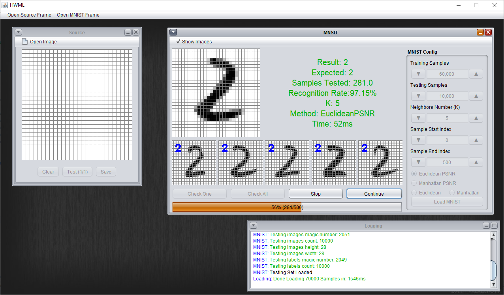

# HandWrittenDigits
> A simple handwritten digit recognition application.

Written in java/swing. Using k-nearest neighbors algorithm with Euclidean or Manhattan distance methods and trained with [MNIST dataset of handwritten digits](http://yann.lecun.com/exdb/mnist/).



## Installation

```sh
-Run HWML.jar in the jar folder
-Or Use Netbeans to open the project and run it
```

## Usage example

1: Upload image(s) of a handwritten digit for recognition

2: Draw a digit using mouse inside the source frame


## Release History

* 0.0.1
    * Work in progress